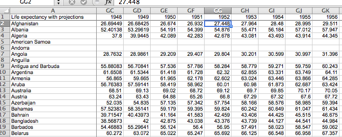
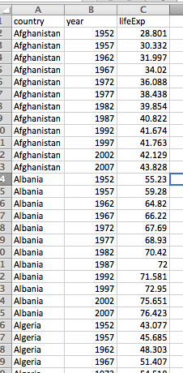

Authors: **Christie Bahlai**, **Aleksandra Pawlik** 
Contributors: **Jennifer Bryan**, **Alexander Duryee**, **Jeffrey Hollister**, **Daisie Huang**, **Owen Jones**,
**Ben Marwick** and **Sebastian Kupny**.

## Learning Objectives
* Learning best practices for recording and formatting data in spreadsheets
* Understanding the correspondence between columns and rows in spreadsheets
and data structure
* Understanding the correspondence between spreadsheet cells, columns and rows
and data observations and values

The most common mistake made is treating the
program like it is a lab notebook- that is, relying on context, notes in the
margin, spatial layout of data and fields to convey information. As humans,
we can (usually) interpret these things, but computers are dumb, and unless
we explain to the computer what every single thing means, it will not be able
to see how our data fit together.

Using the power of computers, we can manage and analyze data in much more
effective and faster ways, but to use that power, we have to set up
our data for the computer to be able to understand it (and computers are very
literal).

This is why it’s extremely important to set up well-formatted tables from the
outset- before you even start entering data from your very first preliminary
experiment. **Data organization is the foundation of your research project.**
It can make it easier or harder to work with your data throughout your
analysis, so it's worth thinking about when you're doing your data
entry or setting up your experiment. You can set things up in a different
way in spreadsheets, but it limits your ability to work with the data
in other programs or have the you-of-6-months-from-now or your collaborator
work with the data.

###Structuring data in spreadsheets

There are two rules you should keep in mind when entering your data
into any spreadsheet:

1. Each data cell is an observation that must have all the relevant information
connected to it for it to stand on its own.

2. You must make it clear to the computer how the data cells relate to the
relevant information and each other.

For instance we have date from the Gapminder dataset. They have information
on things for each country in each year like the GDP, population and life expectancy.

[http://www.gapminder.org/data/](http://www.gapminder.org/data/)

Let's go to that web site and search for 'life expectancy'. On the "Life expectancy at birth, with projections"
click on 'View'. We can see the life expectancy for each country for each year.

This is great, until we think about wanting to compare say life expectancy with GDP. We want the data
to be together, so what do we do, put life expectancy and GDP in the same cell for country and year.
What if we wanted to add more values. This won't scale particularly well.

Let's actually download that life expectancy data and open it in a spreadsheet program. We still see the same
formatting, but let's look at the tabs. A good thing that is done with this data is the About tab. It has the
information about how this data was collected and measured and units of measurement. This is the metadata
for the data, and it's a very important component. This life expectancy data could be meaningless if we didn't
know how it was measured, or if it was measured in months instead of years.

It's important to consider this metadata when you're evaluating existing data, and especially when you're collecting
your own data, making sure to keep track of this information, both for someone else who might use your data,
but also for the you of 6 months from now who won't remember what you did.

###Columns for variables and rows for observations

The rule of thumb, when setting up a datasheet, is columns= variables,
rows = observations, cells=data (values).

So, instead we should have

We can see that now we can add new types of data to this file.

### Exercise

We're going to take a messy version of the Gapminder datasets
and clean it up.

- Download the data in the data package for this workshop
[gapminder-datacarpentry](http://teckla.idyll.org/~tracyt/transfer/gapminder-datacarpentry.zip)

- Unzip the directory

- Open up the data file gapminder-messy.xlsx in a spreadsheet program

- You can see that there are multiple tabs. Different organizations collected the data and they did it in
different ways. Now you've been handed this information and Janet Yellen wants statistics on the relationship
between GDP and population for setting policy.

- With the person next to you, work on the messy data to clean it up so
that a computer will be able to understand it. Just do it for the countries that start with 'A' for 1952 and 1953.

After you go through this exercise, we'll discuss as a group what you think was wrong with this data organization and how you fixed it.  

Previous: [Introduction](00-intro.html)  Next: [Common formatting mistakes](02-common-mistakes.html)
